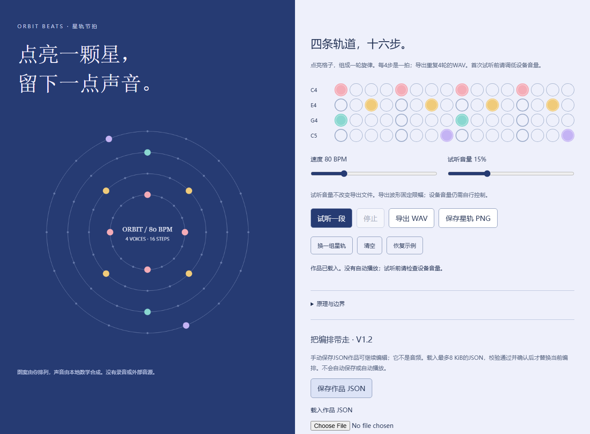

# 星轨节拍 / Orbit Beats V1.2

实际桌面截图，使用原创合成编排。下载完整仓库并解压，打开 `index.html`，在“载入作品 JSON”选择随附 `example-project.json` 可复现编排。载入不会自动播放；试听前调低设备音量。保持文件同目录，不要只下载HTML或在ZIP预览里运行。无需账号或安装依赖；此仓库不是在线托管应用。截图不是声音试听验收。

An original small browser instrument: edit four 16-step tracks, see a constellation, preview synthesized sound and export PCM WAV or a matching PNG. No AI API, samples, microphone or network.

打开 `index.html`，点亮节拍格，再点击“试听一段”。请先调低设备音量。可以导出4轮节拍加尾音的22050Hz单声道16位WAV，或800×800星轨PNG。修改会立即停止旧试听，导出用最新节拍。试听音量只影响预览；WAV使用固定限幅，不替代设备音量控制。

全部代码与声音为独立实现。节拍不自动保存；关闭页面前请手动保存作品 JSON。不是专业DAW、真实天文数据、医疗或收入工具。

## 三步使用

1. 打开 `index.html`，编辑节拍与速度，调低设备音量后试听。
2. 点击“保存作品 JSON”留存可编辑编排；以后通过“载入作品 JSON”继续。载入会先校验格式，再请求覆盖确认，不自动播放。
3. 导出 WAV 音频或 PNG 图片。JSON 是作品数据，不是音频；工具不自动保存、不上传数据。

V1.1 接受本工具格式的 `.json` 文件，最多 8 KiB；仅允许四轨十六步、60–140 BPM、0–50% 试听音量。损坏、未知字段或版本不符的文件不会替换当前编辑；读取过程中若继续编辑，也会取消旧导入。请自行备份保存的 JSON。

## References / research

- https://github.com/madmonk13/modal-16 — existing browser sequencer with Tone.js and richer performance features. No source or samples copied.
- https://github.com/glebis/generative-sequencer — radial visualization inspiration, not a dependency.
- https://developer.mozilla.org/en-US/docs/Web/API/AudioBufferSourceNode — one source node per playback.
- https://developer.mozilla.org/en-US/docs/Web/API/AudioContext/resume — explicit audio initialization.

Research checked 2026-09-22. These precedents mean this is not an original market category or proven commercial opportunity. This experiment deliberately stays dependency-free with mathematical tones and deterministic PCM export.

No reuse license chosen for initial publication. System fonts only. See TEST_RESULTS.md for actual verification and limitations.
# V1.2 audio lifecycle fix

When the page is hidden, playback stops and its audio context is detached before closing. A later manual preview creates a fresh context instead of reusing a closed one. Returning never starts playback automatically. Saved project format and synthesis/export engine are unchanged. A synthetic page-lifecycle regression is tested; actual browser back-forward cache eligibility and physical speakers are not certified.
